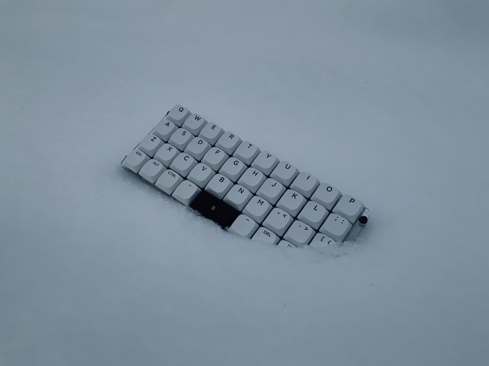

# pkm39

## pkm39は日本語文書におけるマークアップ言語/数式の入力を快適にするために生まれた、39キーのポータブルキーボードです。

* Keyboard Maintainer: [Sota Takahashi](https://github.com/Sahu)
* Hardware Supported: *RP2040(On-board)*
* Hardware Availability: *TBA(will be in 2024)*

### デフォルトのファームウェアの書き込み

Make example for this keyboard (after setting up your build environment):

    make pkm39:default

Flashing example for this keyboard:

    make pkm39:default:flash

### IME切り替えのためのカスタムキーコードを含んだファームウェアの書き込み

Make example for this keyboard (after setting up your build environment):

    make pkm39:custom

Flashing example for this keyboard:

    make pkm39:default:custom

こちらのファームウェアはVIA, Remapに対応しています。

See the [build environment setup](https://docs.qmk.fm/#/getting_started_build_tools) and the [make instructions](https://docs.qmk.fm/#/getting_started_make_guide) for more information. Brand new to QMK? Start with our [Complete Newbs Guide](https://docs.qmk.fm/#/newbs).

## Bootloader

Enter the bootloader in 3 ways:

* **Bootmagic reset**: Hold down the key at (0,0) in the matrix (usually the top left key or Escape) and plug in the keyboard
* **Physical reset button**: PCB裏にある二つのボタンを同時押しすることでファームウェアの書き込みを受け付けることができます。Briefly press the button on the back of the PCB.
* **Keycode in layout**: Press the key mapped to `QK_BOOT` if it is available

うっかりこれらの操作を意図せず行ってもあわてないでください。たいていの場合PCにつなぎなおせば問題ありません。

